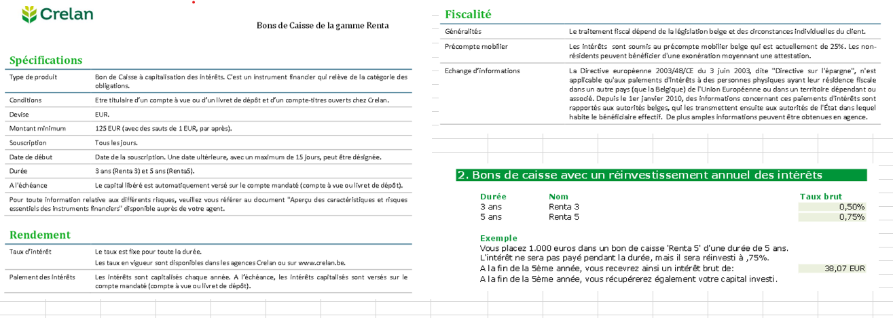

#

## CRELAN



- Co     = 1000
- pm     = 25% (précompte mobilier)
- i_brut = 38.07 (intérêt brut)
- t      = 5
- i      = 0.75%
- i      = (1038.07 / 1000 ) ^ (1/5) - 1 = 0.007498 = 0.75%
#### 

- 1 Quel est le calcul pour trouver 38.07€ ?

```

1000 * (1 + 0.75%) ^ 5 = 1038.066
```
- 2 Quel est l'intérêt net ?

```
i_net  = 28.55 = 38.07 * 0.75%  = i_brut * (1 - pm)
```

- 3 Quel est le taux brut à utiliser pour avoir le même intérêt sur 3 ans (toujours en plaçant 1000€) ?

- Co     = 1000
- pm     = 25% (précompte mobilier)
- i_brut = 38.07 (intérêt brut)
- i_net  = 28.55 (intérêt net)
- t      = 3
- Ct     = 1038.07
  
```
i = (Ct / Co ) ^ (1/t) - 1

i = (1038.07 / 1000 ) ^ (1/3) - 1 = 0.0125 = 1.25%
```

- 4 Quelle durée faudrait il fixer pour qu'au taux de 0,50% on obtienne 38.07€ (toujours en plaçant 1000€)?
- Co     = 1000
- i      = 0.5%
- i_brut = 38.07 (intérêt brut)
- Ct     = 1038.07
  
```
t = log (Ct / Co) / log (1 + i)

t = log (1038.07/1000) / log(1 + 0.5%)

```


