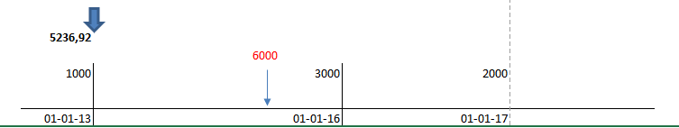

#

## Exos 3.
- Remplacer 3 placements de 1000€, 3000€ et 2000€ 
- faits respectivement le 1er janvier 2013, 2016 (écart 3 ans) et 2017 (écart 4 ans), 
- par un seul placement de 6000€, 
- déterminer le moment de ce placement unique pour qu’il soit équivalent.

- Ct = 6000  
- Co = 5236.92
- i  = 5%.								



  
```
t = LOG( 6000 / 5236.92) / LOG ( 1 + 5%) = 2.79 ans

1000

3000 / (1 + 5%) ^ 3 = 2591.51

2000 / (1 + 5%) ^ 4 = 1645.41

somme(1000 + 2591.51 + 1645.41) = 5236.92
```
