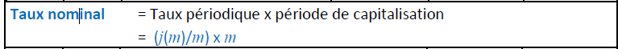

#

## Taux nominal (ou taux débiteur)

- C'est le taux sur le contrat généralement de base annuelle. 
- Il va surtout servir de base à calculer les taux périodiques. 
- Mais attention ce ne sera pas le taux réellement (effectivement) payé 
- si la période de capitalisation est différente de la base annuelle.
- le taux nominal on le nommera j(m)




#### Exo 14
- quel est le taux nominal annuel correspondant au taux périodique semestriel  de 5,55%

- m = 2
   
```
5.55% * 2 = 11,1%
```

#### Exo 9
- quel est le taux nominal annuel correspondant au taux effectif annuel  de 1,35%
- (sur base d'une capitalisation mensuelle)

- i_e = 1.35%
- m = 12
- j(12/12) 
  
```
j(m) / m 
(1 + 1.35%) ^ (1/12) -1 = 0.001118 = 0.1118%

(j(m) / m) * m
0.1118% * 12 = 1.34%

=TAUX.NOMINAL(1,35%;12)
```

#### Exo 10
- quel est le taux nominal annuel correspondant au taux effectif annuel de 6,75% 
- (sur base d'une capitalisation semestrielle)

- m = 2
  
```
(1 + 6.75%) ^ (1/2) -1 = 0.03319 = 3.32%

3.32% * 2 = 6.64%

=TAUX.NOMINAL(6,75%;2)
```

#### Exo 11
- quel est le taux nominal annuel correspondant au taux effectif annuel  de 10,25% 
- (sur base d'une capitalisation mensuelle)


- m = 12
```
(1 + 10.25%) ^ (1/12) - 1 = 0.0081648 = 0.816%

0.816 * 12 = 9.79%

=TAUX.NOMINAL(10,25%;12)
```