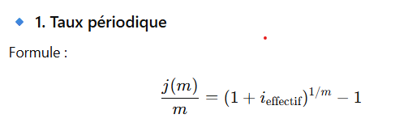

#

## Taux périodique (ou proportionnel)
- C'est le taux calculé sur base de la période de remboursement. 
- Dans beaucoup de cas les remboursements se font mensuellement 
- et donc on paie des intérêts non plus sur base d'un an mais par mois. 
- Il faut donc diviser le taux débiteur annuel par 12.
- C'est un taux mensuel qui représente une proportion du taux nominal. 
- (=> le nom aussi taux proportionnel).
- le taux périodique on le nommera j(m)/m


#### Exo 6
- quel est le taux périodique semestriel correspondant au taux nominal annuel de 2,95%

- i_e = 2.95%
- m   = 2
  
```
j(2/2) = 2.95%/2 = 1.475%
```

#### Exo 7
- quel est le taux périodique mensuel correspondant au taux nominal annuel de 1,75%

- i_e = 1.75%
- m   = 12 
  
```
1.75% / 12 = 0.1458%
```

#### Exo 13 
- quel est le taux périodique trimestriel correspondant au taux nominal annuel de 5,5%

- i_e = 5.5%
- m   = 4 

```
5.5% / 4 = 1.375%
```



```
j(m) / m = (1 + i_effectif ) ^ (1/m) - 1
```

#### Exo 1
- quel est le taux périodique semestriel correspondant au taux annuel effectif de 3,05%

- m = 2 (semestriel)
- i_periodique 

```
(1 + 3.05%) ^ (1/2) - 1 = 0.0151 = 1.51%

=TAUX.NOMINAL(3,05%;2)/2

```

#### Exo 5
- quel est le taux périodique mensuel correspondant au taux effectif annuel de 4,85%

- i_e = 4.85%
- m   = 12
  
```
(1 + 4.85%) ^ (1/12) - 1 = 0.00395 = 0.395%

=TAUX.NOMINAL(4,85%;12)/12
```

#### Exo 8
- quel est le taux périodique trimestriel correspondant au taux effectif annuel de 2,25% 

- i_e = 2.25%
- m   = 4 (trimestre 3 mois) 
  
```
(1 + 2.25%) ^(1/4) - 1 = 0.005578 = 0.5578%

=TAUX.NOMINAL(2,25%;4)/4
```

